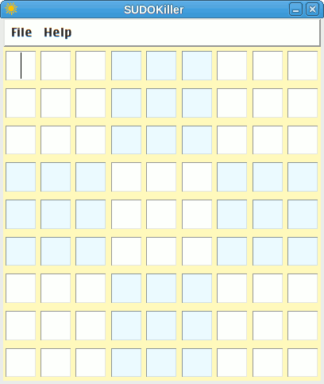

# SUDOKiller

A straightforward sudoku solving app. It has a Tkinter GUI and uses a terse and powerful recursive algorithm, based on an example demonstrated by Professor Thorsten Altenkirch in *[this](https://youtu.be/G_UYXzGuqvM)* Numberphile episode.

Usage:
1. Input an unsolved sudoku pattern (`Tab->|` moves cursor from top-left towards bottom-right cell).
2. Select menu **File>Solve**.
3. Behold the returned solution.

&nbsp;

